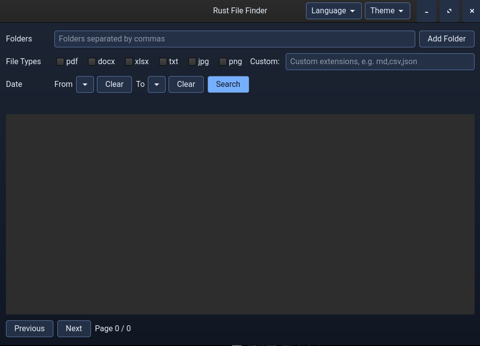

# File Finder

## EN

### About
This repository is a **test and learning project** created as part of **learning React with Codex**.
Even though the current result is a **Rust desktop application with GTK4**, the repository is mainly meant for experimentation, learning workflows, and iterating on features together with Codex.

The application is a simple file finder that lets the user:
- select one or more folders
- filter files by type
- optionally filter by date range
- browse paginated results
- open found files by double-click
- switch application theme
- switch UI language between English and Czech

### Purpose
The goal of this project is not to be a finished production tool.
It is primarily intended to:
- test how Codex can help with app development
- practice translating feature ideas into working code
- experiment with UI improvements and validation
- use a small practical project as a learning sandbox

### Tech Stack
- Rust
- GTK4
- Cargo

### Features
- Desktop GUI
- Folder picker
- File type filtering with predefined checkboxes and custom extensions
- Optional date filtering
- Double-click to open results
- Light and dark themes
- Persistent theme selection
- English and Czech UI
- Persistent language selection

### Screenshot


### Run
```bash
cargo run --bin rfindfiles
```

### Build Release
```bash
cargo build --release --bin rfindfiles
```

### Linux Installation
Use the provided install script:

```bash
./scripts/install-linux.sh
```

The script will:
- build the release binary
- install it into `~/.local/bin/rfindfiles`
- create a desktop launcher in `~/.local/share/applications/rfindfiles.desktop`

If you prefer to do it manually, follow these steps.

Build the release binary:

```bash
cargo build --release --bin rfindfiles
```

Install the binary into your local user bin directory:

```bash
mkdir -p ~/.local/bin
cp target/release/rfindfiles ~/.local/bin/rfindfiles
chmod +x ~/.local/bin/rfindfiles
```

Create a desktop entry so the app appears in your application launcher:

```bash
mkdir -p ~/.local/share/applications
cat > ~/.local/share/applications/rfindfiles.desktop <<'EOF'
[Desktop Entry]
Type=Application
Name=File Finder
Comment=Simple GTK file finder written in Rust
Exec=/home/$USER/.local/bin/rfindfiles
Icon=system-file-manager
Terminal=false
Categories=Utility;FileTools;
StartupNotify=true
EOF
```

If your desktop environment does not expand `$USER` in the `Exec` field, replace it with your absolute home path manually, for example `/home/michal/.local/bin/rfindfiles`.

After that, the application should be available from the system application menu. You can also run it directly with:

```bash
~/.local/bin/rfindfiles
```

### Note
This is a **test repository for learning and experimentation with Codex**.
The original learning context was **React**, but the current implementation in this repository is a **Rust GTK desktop app**.

---

## CZ

### O projektu
Tento repozitář je **testovací a výukový projekt**, vytvořený v rámci **výuky Reactu s použitím Codexu**.
I když je aktuálním výsledkem **desktopová aplikace v Rustu s GTK4**, hlavním cílem repozitáře je experimentování, učení pracovního postupu a postupné rozšiřování funkcionality společně s Codexem.

Aplikace je jednoduchý vyhledávač souborů, který umožňuje:
- vybrat jednu nebo více složek
- filtrovat soubory podle typu
- volitelně filtrovat podle rozsahu dat
- procházet výsledky po stránkách
- otevřít nalezené soubory dvojklikem
- přepínat vzhled aplikace
- přepínat jazyk rozhraní mezi angličtinou a češtinou

### Účel
Cílem tohoto projektu není hotový produkční nástroj.
Slouží především k tomu, aby bylo možné:
- testovat, jak může Codex pomoci při vývoji aplikace
- procvičit převod nápadů na fungující kód
- experimentovat s UI úpravami a validací
- použít malý praktický projekt jako výukové prostředí

### Technologie
- Rust
- GTK4
- Cargo

### Funkce
- Desktopové GUI
- Výběr složek přes dialog
- Filtrování podle typů souborů pomocí checkboxů a vlastních přípon
- Volitelné filtrování podle data
- Otevírání výsledků dvojklikem
- Světlé i tmavé motivy
- Perzistentní uložení motivu
- Anglické a české rozhraní
- Perzistentní uložení jazyka

### Screenshot


### Spuštění
```bash
cargo run --bin rfindfiles
```

### Release build
```bash
cargo build --release --bin rfindfiles
```

### Instalace na Linuxu
Použijte připravený instalační skript:

```bash
./scripts/install-linux.sh
```

Skript:
- vytvoří release build
- nainstaluje binárku do `~/.local/bin/rfindfiles`
- vytvoří desktop launcher v `~/.local/share/applications/rfindfiles.desktop`

Pokud to chcete provést ručně, pokračujte tímto postupem.

Nejprve vytvořte release build:

```bash
cargo build --release --bin rfindfiles
```

Potom zkopírujte binárku do lokálního adresáře pro uživatelské programy:

```bash
mkdir -p ~/.local/bin
cp target/release/rfindfiles ~/.local/bin/rfindfiles
chmod +x ~/.local/bin/rfindfiles
```

Vytvořte `.desktop` soubor, aby se aplikace objevila v nabídce aplikací:

```bash
mkdir -p ~/.local/share/applications
cat > ~/.local/share/applications/rfindfiles.desktop <<'EOF'
[Desktop Entry]
Type=Application
Name=File Finder
Comment=Simple GTK file finder written in Rust
Exec=/home/$USER/.local/bin/rfindfiles
Icon=system-file-manager
Terminal=false
Categories=Utility;FileTools;
StartupNotify=true
EOF
```

Pokud vaše desktopové prostředí nerozbalí `$USER` v poli `Exec`, nahraďte ho ručně absolutní cestou, například `/home/michal/.local/bin/rfindfiles`.

Poté by aplikace měla být dostupná ze systémového menu. Spustit ji můžete také přímo:

```bash
~/.local/bin/rfindfiles
```

### Poznámka
Jde o **testovací repozitář pro výuku a experimentování s Codexem**.
Původní výukový kontext byl zaměřený na **React**, ale aktuální implementace v tomto repozitáři je **desktopová aplikace v Rustu a GTK**.
